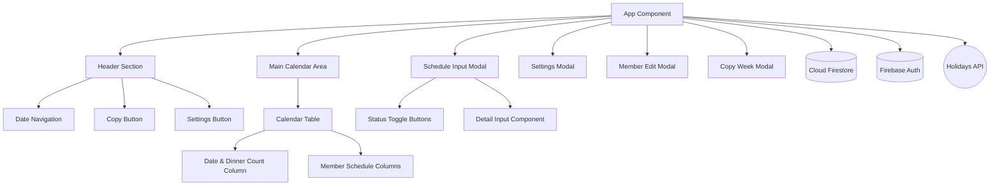
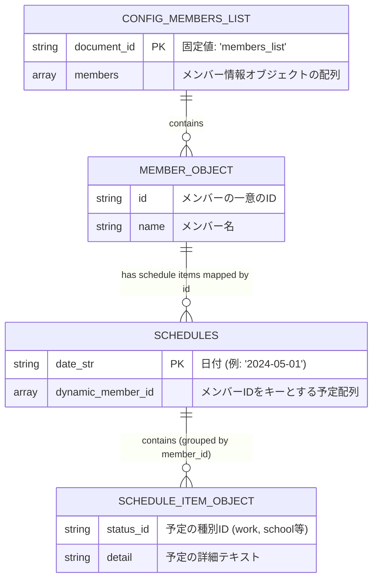

# Family Plan システム設計書

## 1. 技術スタック

### フロントエンド
* **ライブラリ:** React (Functional Components, Hooks)
* **スタイリング:** Tailwind CSS
* **アイコン:** インラインSVG (独自実装)
* **ビルドツール:** Vite または Create React App (想定)

### バックエンド / インフラ
* **BaaS:** Firebase
    * **認証:** Firebase Authentication (匿名ログイン)
    * **データベース:** Cloud Firestore (NoSQL)
    * **ホスティング:** Firebase Hosting (想定)

### 外部API
* **日本の祝日データ:** `holidays-jp.github.io/api` (JSON)

---

## 2. アプリケーション構造図

---

## 3. テーブル（コレクション）設計書

本システムはNoSQLであるCloud Firestoreを使用しているため、リレーショナルデータベース(RDB)のような厳密なテーブル定義はありませんが、ドキュメントの構造を以下に定義します。

### 3.1. `config` コレクション
システム全体または家族グループの基本設定を保存します。

* **ドキュメントID:** `members_list`
* **用途:** 家族メンバーの表示順序と基本情報の管理

| フィールド名 | データ型 | 説明 | 例 |
| :--- | :--- | :--- | :--- |
| `members` | Array | メンバー情報のオブジェクト配列。配列の順序がUIの表示順となる。 | `[{id: "0", name: "パパ"}, ...]` |
| `members[].id` | String | メンバーの一意の識別子。 | `"0"`, `"1"` |
| `members[].name`| String | メンバーの表示名。 | `"パパ"` |

### 3.2. `schedules` コレクション
各日付のスケジュールデータを保存します。

* **ドキュメントID:** 日付文字列 (`YYYY-MM-DD` 形式)
* **用途:** その日の全メンバーの予定詳細の管理

| フィールド名 | データ型 | 説明 | 例 |
| :--- | :--- | :--- | :--- |
| `{memberId}` | Array | メンバーIDをキーとした配列。そのメンバーのその日の予定リスト。 | `"0": [{id: "work", detail: "在宅"}, ...]` |
| `{memberId}[].id`| String | 予定ステータスのID (`work`, `school`, `no_dinner` など)。 `STATUS_OPTIONS` と紐づく。 | `"work"` |
| `{memberId}[].detail`| String | 予定の付加情報（時間、時限、テキストなど）。 | `"09:00〜18:00"` |

---

## 4. ER図（概念データモデル）

NoSQLデータベースですが、データ間の概念的な関連性を表現した図です。

### 今後の拡張（ユーザー単位の分離）に向けた設計メモ
現状はすべてのデータがルート階層に置かれていますが、外部公開時に家族ごとにデータを分離する場合は、以下のようにルートをユーザー（または家族グループ）単位にする階層化が必要です。

* `users/{userId}/config/members_list`
* `users/{userId}/schedules/{YYYY-MM-DD}`